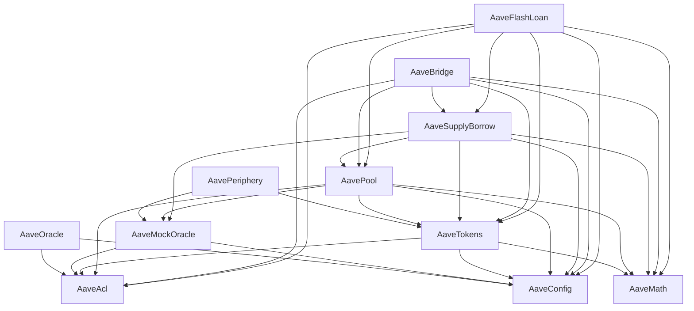

# Aave's V3 Protocol on Aptos

This is the official Aptos version of the Aave V3 Protocol.

## Aptos Packages Overview

```bash=
├── aave-acl           // Access control list Package
├── aave-bridge        // Bridge Package
├── aave-config        // Configurator Package
├── aave-flash-loan    // Flash loan Package
├── aave-math          // Math library Package
├── aave-oracle        // Chainlink Oracle Package
├── aave-pool          // Pool Package
├── aave-supply-borrow // Supply-Borrow Package
├── aave-tokens        // Tokens Package
├── aave-periphery     // Periphery Package
```

Dependencies for all packages:

<!--
    subgraph Level 1
      AaveAcl
      AaveConfig
      AaveMath
    end

    subgraph Level 2
      AaveOracle
      AaveMockOracle
      AaveTokens
    end

    subgraph Level 3
      AavePeriphery
      AavePool
    end

    subgraph Level 4
      AaveSupplyBorrow
    end

    subgraph Level 5
      AaveBridge
      AaveFlashLoan
      AaveScripts
    end
-->



## 1. Clone the code

```bash=
git clone (aave-aptos-v3)(https://github.com/aave/aptos-v3) && cd into it
```

Make sure you have the following installed and configured:

- Aptos-Cli [see here](https://aptos.dev/tools/aptos-cli/)
- Yq tool: [see here](https://github.com/mikefarah/yq)
- NodeJS/pnpm/npm/yarn [see here](https://pnpm.io/installation)
- Codespell [see here](https://pypi.org/project/codespell/)
- Pre-commit [see here](https://pre-commit.com/#install)
- Python3 [see here](https://www.python.org/)

## 2. Local Testnet using Makefile

Local testnet commands are all bundled inside a `Makefile` at the root.

There is a `.env.template` template at the root that we recommend renaming to `.env` and adjusting the values of before executing the remaining steps.

Prior to all, run:

```shell
make local-testnet
```

to start the local testnet without indexer. It usually takes about 10 seconds for the local testnet to be fully operational.

Once local testnet is running, in another terminal do:

```shell
make init-profiles && make init-test-profiles && make fund-profiles && make fund-test-profiles
```

This will create all needed accounts for publishing Aave V3 and save them under a file under `.aptos/config.yaml` at the workspace root.
The accounts will be prefunded with APT too.

All aave packages can be now compiled using the command:

```shell
make compile-all
```

and subsequently deployed to local testnet via:

```shell
make publish-all
```

If needed one could also run all aptos unit tests via:

```shell
make test-all
```

To view transactions or query any data deployed on the local testnet you
can use the following url:

<https://explorer.aptoslabs.com/?network=local>

## 3. Local Testnet using Apterly

Apterly is a tool that mimics some of the functionalities that Tenderly offers. You can read more about it under [Apterly](apterly/README.md). Follow the Readme if you want to deploy the protocol using docker-compose.

## 4. Checking contracts in explorer

For each published package, get the transaction id `YOUR_TX_ID` and replace it in the url below to see more data. Also make
sure you are using the correct network in the url - `devnet` or `testnet`.

> <https://explorer.aptoslabs.com/txn/{YOUR_TX_ID}?network=NETWORK_NAME>

## 5. Running Aptos Unit Tests

These tests do not require any published data and can thus be executed every time, prerequisite being we have all named
addresses set:

```shell
make test-all
```

## 6. Running Typescript Integration/e2e Tests

These tests are only to be run after having successfully published all packages:

```shell
make ts-test
```

## 7. Creating Aptos Documentation

To create extensive Aptos documentation for all modules usually generated under the `doc` folder of each package, run:

```shell
make doc-all
```
